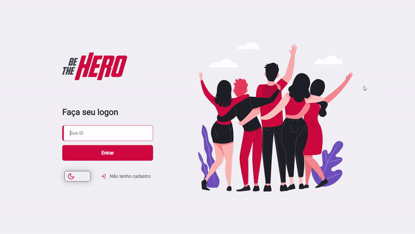
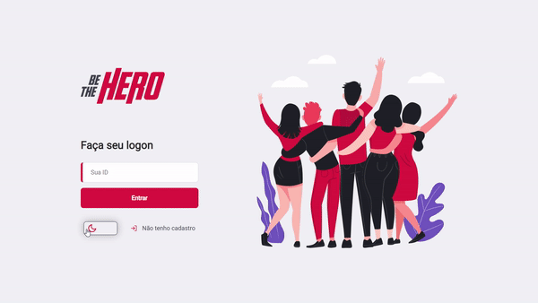
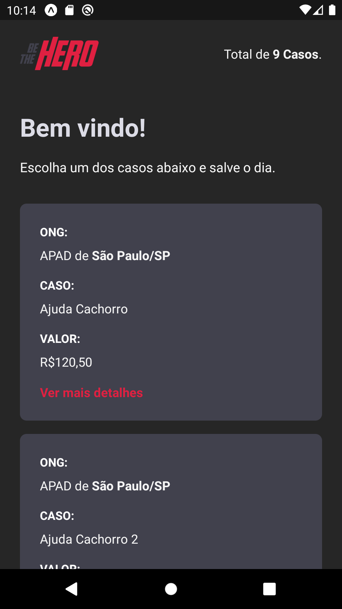
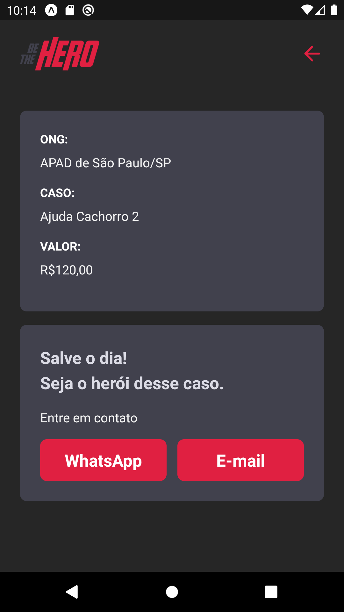

<div align="center">
  
</div>

<h3 align="center">
  A platform to help ONGs raise funds to solve cases
</h3>

<div align="center">
  
  
  
</div>
<div>

<p align="center">
  <a aria-label="Versão do Node" href="https://github.com/nodejs/node/blob/master/doc/changelogs/CHANGELOG_V12.md#12.16.1">
    </img>
  </a>
  <a aria-label="Versão do React" href="https://github.com/facebook/react/blob/master/CHANGELOG.md#16131-march-19-2020">
    </img>
  </a>
  <a aria-label="Dia 5 de 5" href="https://rocketseat.com.br/week/aulas/11.0?aula=5">
    </img>
  </a>
</p>
<br>

---

# BeTheHero

Esse projeto foi desenvolvido durante a Semana Omnistack 11.0 da <a href="https://rocketseat.com.br/">Rocketseat</a> que durou de 23/03 a 28/03/2020. O projeto será frequentemente atualizado com novas **features** para fixação de conteúdo e upgrade das minhas **skills**.
<br>

## Instalação

Para instalar as dependências e executar o Servidor (modo desenvolvimento), clone o projeto em seu computador efetue uma cópia do arquivo `.env.example` e renomeie como `.env` no **backend**, faça as alterações necessárias e em seguida execute (à partir do _root_ do projeto):

```bash
cd backend
yarn install
yarn dev
```

Para iniciar o Frontend do React utilize o comando (à partir do _root_ do projeto):

```bash
cd frontend
yarn install
yarn dev
```

É possivel ainda na raiz do projeto iniciar os seguintes comandos:

| Função              | Description                                     |
| ------------------- | ----------------------------------------------- |
| `yarn install:yarn` | Instalar as dependencias de todos os projetos.  |
| `npm install:npm`   | Instalar as dependencias de todos os projetos.  |
| `yarn start`        | Iniciar os projetos em modo de desenvolvimento. |

Assim que o processo terminar, automaticamente será aberta no seu navegador a página `localhost:3000` contendo o Projeto desenvolvido até agora (Dia 5 de 5).
<br>

## Backend

Veja mais em [backend/README.md](./backend) para informações sobre o servidor e sua arquitetura.
<br>

### Imnsonia

Para testar a API do BeTheHero, baixe e instale o [Insomnia](https://insomnia.rest/download/) e em seguida clique na Workspace → `Import/Export` → `Import Data` → `From File` → e selecione o arquivo [`Insomnia.json`](./Insomnia.json). Assim que terminar, o resultado ficará assim:

<p align="center">
  </img>
</p>

[](https://insomnia.rest/run/?label=Be%20The%20Hero&uri=https%3A%2F%2Fraw.githubusercontent.com%2FWilliamJesusDev%2FBeTheHero%2Fmaster%2FInsomnia.json)
<br>

## Frontend

Veja o projeto rodando em [https://williamjesusdev.github.io/BeTheHero](https://williamjesusdev.github.io/BeTheHero) ou em [frontend/README.md](./frontend) para informações sobre client Web e os padrões.
<br>

<div align="center">
  <h2>Light Theme</h2>
  
  <br>
  <br>
  <h2>Dark Theme</h2>
  
</div>
<br>

## Mobile

Veja mais em [mobile/README.md](./mobile) para informações sobre client Mobile e os padrões.
<br>

<div align='center' >
  <p align='center'>Telas<p>
  <p align='center'>Light Theme <----------  ----------> Dark Theme<p>
  </img>
  </img>
  </img>
  </img>
  </img>
</div>
<br>
<div align="center" >
  <p>Abra o projeto mobile utilizando <a href="https://expo.io/">Expo</a><p>
  </img>
</div>
<br>

## Snapshots

Veja também as [capturas te tela](./assets) de todos os projetos.
<br>

##### CRONOGRAMA

---

- `Aula 01 - 23/03`

  - bate-papo sobre a stack `Node | React | React Native`
  - informações sobre o projeto **BeTheHero**
  - configuração do ambiente de desenvolvimento e dicas
    <br>

- `Aula 02 - 24/03`

  - inicio do projeto [backend](./backend) - `Node`
  - configuração do servidors utilizando `express`
  - configuração do banco de dados `sqlite` com `knex`
  - configuração de rotas de requisição `Http - Requests`
  - configuração de **_migrations_** e **_controllers_**
  - testes de requisições através do [Insomnia.REST](https://insomnia.rest/)
  - adição da biblioteca `cors` no **backend** possibilitando acesso via **frontend**
    <br>

- `Aula 03 - 25/03`

  - inicio do projeto [frontend](./frontend) - `React`
  - criação do projeto com `yarn create-react-app`
  - configuração de rotas de acesso com `react-router-dom`
  - criação das pages **Logon** e **Register** `Components`
  - adição da biblioteca `axios` e configuração do `services/api.js` para requisições ao **backend**
    <br>

- `Aula 04 - 26/03`

  - inicio do projeto [mobile](./mobile) - `React Native`
  - adição global da **expo-cli** com `yarn global add expo-cli`
  - criação do projeto com `expo init mobile`, `cd mobile` e `expo start`
  - configuração de rotas de acesso com `react-navigation`
  - criação das páginas **Incidents** e **Detail** `Components`
  - criação do Scroll Infinito `Flatlist`
  - adição da biblioteca `axios` e configuração do `services/api.js`
    <br>

- `Aula 05 - 27/03`
  - inclusão de **Validação** `celebrate` **backend**
  - inclusão de **Testes** `jest` e `supertest` **backend**
  - bate-papo sobre **Deploy**, **Padrões de Código** `eslint` e `prettier`
  - bate-papo sobre **Styled Components** e **Autenticação** `jwt`
  - finalização do projeto e bate-papo
    <br>

---

##### FEATURES - EXTRAS

---

- `feature 01`

  - adição e configuração das bibliotecas **eslint**, **prettier**, **sucrase** e **dotenv** no backend possibilitando uma melhora produtividade.
    <br>

- `feature 02`

  - adição e configuração da biblioteca **styled-components** no frontend permitindo estilização perfeita e sem quebras nos componentes.
    <br>

- `feature 03`

  - adição e configuração do tema dark utilizando ThemeProvider do **styled-components** no frontend.
    <br>

- `feature 04`

  - disponibilização da _api_(**backend**) no [heroku](https://w-bethehero.herokuapp.com/) e do _web_(**frontend**) no [github](https://williamjesusdev.github.io/BeTheHero/).
    <br>

- `feature 05`

  - Dark Theme no mobile com auteração automatica definida pela configuração do dispositivo.
    <br>

- `feature 06`

  - disponibilização da _mobile_(**mobile**) no [exp.host](https://exp.host/@williamjesusdev/bethehero).
    <br>
---

#### PROJETO FINALIZADO | `29/03/2020`

## Contributing

Please read [CONTRIBUTING.md](CONTRIBUTING.md) for details on our code of conduct, and the process for submitting pull requests.

## License

This project is licensed under the MIT License - see the [LICENSE.md](LICENSE.md) file for details.

Criado com :hearts: por William :wave:
